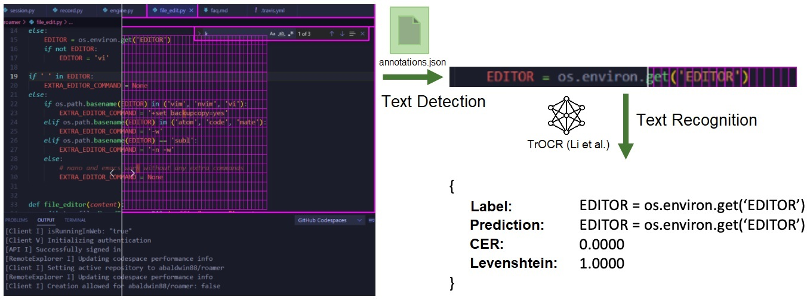
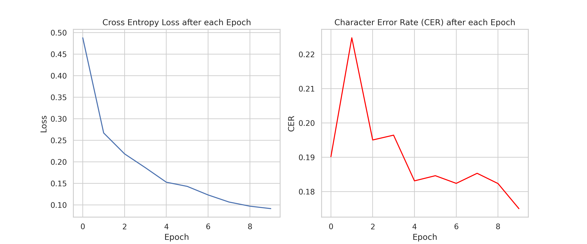
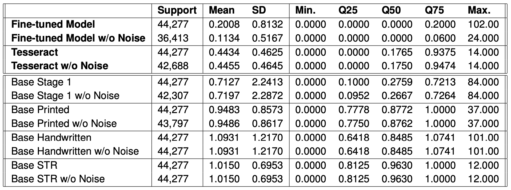
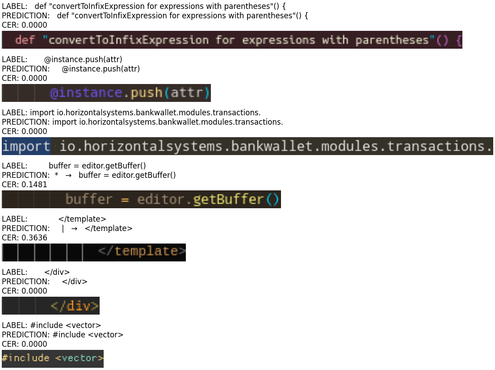

# Seminar: OCR on Code Screenshots – Training a Transformer based OCR Engine
Repository of our seminar project **'OCR on Code Screenshots – Training a Transformer Based OCR Engine'** at FZI.  
Final elaboration can be found in the document directory.

## Project Team
**Use Case Owner:** Alexander Naumann

**Team Members:**
- Alessio Negrini (Mart.nr.: ...)
- Nikolas Heß (Mart.nr.: ...)

## About the Project
We fined tuned the [TrOCR by Li et al](https://arxiv.org/abs/2109.10282) on around 450.000 code snippets and achieved an average CER of around 0.11 (see results table below). The model was splitted into 80-10-10 sets (Train, Validation and Test Set).


*Example of the data used to train the model of this paper: A screenshot of an IDE, where
lines are cropped from using annotation-files that contained the text locations within the im-
age. These code line snippets were then used to train the model. To evaluate the model’s
performance, unseen code snippets from the test set were used to calculate evaluation met-
rics such as CER and Levenshtein distance.*


*Cross Entropy Loss and mean CER after each epoch. The CER is calculated on the vali-
dation set after each epoch. The model yields a favorable result, but the CER leaves room
for improvement due to noise characters such as ’→’ and ’|’ that the model falsely predicts.*


*Comparison of the trained model (first two rows), which was fine-tuned on the TROCRBASE -
stage1 model with the Tesseract model and the other stage 2 models by Li et al. For
the evaluation metric the CER was used. All models were tested on the test set consisting
of unseen data samples. With a mean CER of 0.2, our fine-tuned model significantly outper-
formed Tesseract and the other models.*

## Testing

*Models prediction on n = 7 random samples from the test set. For each sample, the model
prediction, label, computed CER and input-image is shown. In the third last sample, the model
predicts noise characters that increase the CER significantly, even though the actual text is
transcribed perfectly*

## Setup
**Operating System:** Windows

**Python Version:** 3.9.15

**Environment:**
```sh
conda create -n trocr python=3.9.15
conda activate trocr
```

**Project:**
```sh
git clone https://ipe-wim-gitlab.fzi.de/video2code/trocr.git
# cd into project root directory
pip install -r requirements.txt
python setup.py install
```

**To run Notebooks:**
```sh
python -m ipykernel install --user --name=trocr
jupyter notebook # or open them in VSCode
```


## Project Structure
```sh
├── README.md
├── .gitignore
├── requirements.txt
├── setup.py
├── data                                        <-- Folder containing all data files.
│   ├── extracted                               <-- Folder containing extracted data files generated by DataExtractor class.
│   └── raw                                     <-- Folder containing all raw data files. Structure is language/repository/file/relevant_data.
│       ├── language 1
│       │   ├── repo 1
│       │   │   ├── file 1
│       │   │   │   ├── annotations.json        <-- Annotation file, contains metadata about images.
│       │   │   │   ├── info.json               <-- Info file, contains metadata about images.
│       │   │   │   ├── bw.png                  <-- Black and white image.
│       │   │   │   ├── img.png                 <-- Color image.
│       │   │   │   ├── page_bw.html            <-- Black and white image as html-page.
│       │   │   │   ├── page_img.html           <-- Color image as html-page.
│       │   │   │   └── source.txt              <-- Source text within the image.
│       │   │   ├── file 2
│       │   │   └── ...
│       │   ├── repo 2
│       │   └── ...
│       ├── language 2
│       └── ...
│
├── models                                      <-- Our models & checkpoints.
├── notebooks                                   <-- Our notebooks for data analysis & modeling
├── img                                         <-- EDA plots as well as evaluation of our model(s)   
└── src
     ├── custom_model.py                        <-- Our custom model based on TrOCR. Contains methods for training, evaluating, and predicting.
     └── data_extraction.py                     <-- Class that handles data extraction from json files.
     └── dataset_iterator.py                    <-- Implementation of PyTorch Dataset and Dataloader for the training of our model
     └── utils.py                               <-- Helper function for our classes
```
